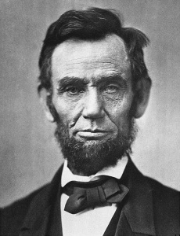
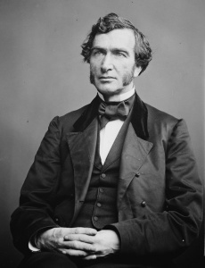

```{r setup, include=FALSE}
knitr::opts_chunk$set(echo = TRUE)
library(DT)
library(dplyr)
```

<div style="width:440px; margin:2em auto;"></div>

# I. The Origins of US "Land Grant" Universities

<div style="float:right; border:1px solid gray; padding:5px; margin-left:20px; margin-bottom:10px; box-shadow:4px 4px #888888;"><a href="https://nifa.usda.gov/sites/default/files/resource/LGU-Map-03-18-19.pdf" target="_blank"></a><br><span style="font-style:italic; font-size: 90%;">US Land Grant Universities and Colleges. Source: <a href="https://nifa.usda.gov/resource/land-grant-colleges-and-universities-map
">USDA</a></span></div>

Did you ever wonder how the big public universities across the USA (e.g., University of Michigan, University of California) came into being? Many of the big state schools were established or got a big boost from the [1862 Morrill Act](https://en.wikipedia.org/wiki/Morrill_Land-Grant_Acts), which created what is today known as the "Land Grant University" system. 

But what does "Land Grant University" actually mean? Before we get to that, a little more background on the Morrill Act.

Abraham Lincoln signed the Morrill Act into law in July 1862, during the middle of the Civil War. This visionary piece of legislation provided support and incentives for the States to establish colleges for "*agriculture and the mechanical arts*" (i.e., engineering). At the time, the country needed engineers for big infrastructure projects like the railroads and factories. Most of the population was also still in farming, for which there was little research or training. The few Universities in those days were expensive and focused on the liberal arts and business. Senator Samuel Morrill had been trying for several years to incentivize the States to establish more applied colleges, and with the southern States temporarily out of the Union, he had enough votes.

<div style="width:500px; margin:2em auto;">
<div style="text-align:center; display:inline-block; margin-right:10px;"><br/>Abraham Lincoln</div>
<div style="text-align:center; display:inline-block;"><br/>Senator Justin Morrill</div>
</div>

# II. Incentivizing States to Build Colleges

But how exactly do you support 48 States, all at various stages of development, to increase colleges for Agriculture and the Mechanical Arts?

The federal government didn't have much spare cash at the time, and everything they had was going to the war. But what they did have however was land, a lot of it, particularly in the large western states like California where Native American tribes had been widely displaced and populations decimated by disease and violence. The Federal government was eager to 'dispose' of public lands across the country and get it into the hands of settlers and companies who could put it into production and commerce. Legislation involving Land Grants was therefore quite common in those days, perhaps the famous being the [Homestead Act](https://en.wikipedia.org/wiki/Homestead_Acts){target="_blank"} which was passed just two months before the Morrill Act.

Under the Morrill Act, each State was given 30,000 acres for each Congressman and Senator. The idea was not that a State would build a campus on lands given under the act, but that they could sell or lease the land and use the money to create an endowment to support the operational costs for a college. The totals alloted ranged from 990,000 acres for a populous state like New York, down to a mere 90,000 acres for low-population states that only had one Representative and two Senators.

21 western States had enough public land, so they could just pick unclaimed public land within their borders as long as it was i) surveyed and ii) not classified as mining land. However 27 other states, mostly in the the east and south, didn't have enough unsettled public land left. So instead, the Morrill Act gave these States land 'scrip', or coupons, for an equivalent amount of land that they could sell on the market, and use the money to support their university. The purchasers of those coupons could then go to a State out west and redeem them for a piece of unsettled public land. Hence public land in States like California was given away not only to support running a college within California, but also states back east.

# III. Mapping the Morrill Act Lands

The Morrill Act Map is intended to help anyone who is interested in the origins of the US land grant universities, or wishes to reconnect with our roots -  literally. The map aims to show all of the federal lands that were transferred under the Morrill Act of 1862. 

<div style="margin:2em 3em; padding:8px; border:1px solid lightgray;">**CAVEATS**: The map is a work in progress and does not currently show *all* the land given out under the Morrill Act. Completeness varies from state to state, see the table below.</div>

<a href="http://arcg.is/0bWLHe" target="_blank"></a>

*Land transferred to the States under the 1862 Morrill Act. [Click](http://arcg.is/0bWLHe){target="_blank"} to open in a new window.*

## Patterns Revealed

The map shows spatial and temporal patterns of land allocation....

See also papers by Sauder.


## How the Map Was Made

This map is derived from the orginal Federal Land Patent records (a Land Patent is like the original title deed for a piece of land) that were issued by the US General Land Office (now the [Bureau of Land Management](https://www.blm.gov/)). These documents have been digitized by the *Bureau of Land Management, Eastern States Office* (see [https://glorecords.blm.gov/](https://glorecords.blm.gov/), and parcel boundaries generated in a GIS format. The BLM  make these data available on their [website](https://glorecords.blm.gov/BulkData/default.aspx){target="_blank"} as CSV files, and they also provide an [API Service](https://gis.blm.gov/arcgis/rest/services/Cadastral/BLM_Natl_PLSS_CadNSDI/MapServer/exts/CadastralSpecialServices/FindLD) through which the boundaries of parcel can be retrieved. An R script was used to download the data and generate the polygons for the map.

## Status of the Map 

The table below shows the current numbers of Land Patents, parcels (i.e., a textual land description), and polygons available for each State. Notes:

- Not all States are included because many States didn't have enough unclaimed public land remaining in 1862, and hence no federal land was given out under the Morrill Act.

- The number of parcels (land descriptions) frequently exceeds the number of Land Patents because some Patents have more than one parcel listed.

- Not all all parecls are shown on the map due to i) the R code may is not able to parse the land description (a work in progress) and/or ii) a polygon boundary may not be available in the GLO database (BLM continues to update the GIS data).

```{r map_dat_status, cache=FALSE, echo=FALSE}
load("../pat_stats.RData")
dt_opts <- list(paging = FALSE, searching = FALSE, info = FALSE)

DT::datatable(pat_stats %>% 
                select(state, num_pat, num_ld, geom_success_num, geom_success_pct) %>% 
                arrange(state), 
          class = 'row-border stripe hover compact', 
          rownames = F, 
          colnames = c('State' = 'state', 'Patents' = 'num_pat', 'Num Land Desc' = 'num_ld', 'Land Desc on Map (num)' = 'geom_success_num', 'Land Desc on Map (pct)' = 'geom_success_pct'),
          autoHideNavigation = T, 
          caption = paste0("Morrill Map Data Status (", Sys.Date(), ")"),
          options = dt_opts) %>% 
  formatPercentage(columns = "Land Desc on Map (pct)") 
```

# IV. State Summaries

*Coming soon...*


# V. About the Project

*Mapping the Morrill Act* is being undertaken by a group of academics within the University of California Division of Agriculture and Natural Resources and UC Berkeley, including [Andy Lyons](https://ucanr.edu/?facultyid=32909){target="_blank"}, [Lucy Diekmann](http://cesantaclara.ucanr.edu/Programs/contact/?facultyid=40005){target="_blank"}, [Jennifer Sowerwine](https://ucanr.edu/?facultyid=5143){target="_blank"}, and Jason Lam. Additional support has been provided by the Bureau of Land Management, Eastern States Office. 

For questions and comments, please email *andlyons at ucanr dot edu*.

---

<a href="http://igis.ucanr.edu" target="_blank"></a>

