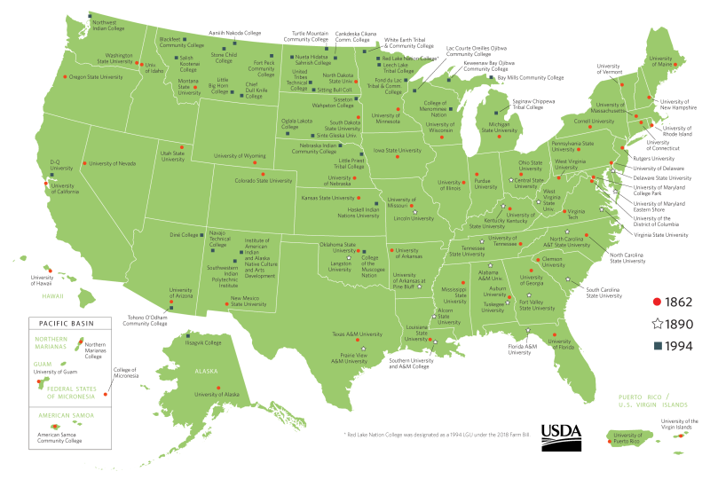

```{r setup, include=FALSE}
knitr::opts_chunk$set(echo = TRUE)
```

# The "Land Grant" Network of Public Universities in the USA

Did you ever wonder how the big public universities in the US like the University of Michican, or the University of California got started? Many of the big state schools got started with the help from the [1862 Morrill Act](https://en.wikipedia.org/wiki/Morrill_Land-Grant_Acts) which started the "Land Grant University" system.

<p style="margin:2em 0; text-align:center;"><br><span style="font-style:italic;">Land Grant Universities and Colleges. Source: <a href="https://nifa.usda.gov/resource/land-grant-colleges-and-universities-map
">USDA</a></span></p>

# Background

During the middle of the Civil War, this act provided support for the States to establish colleges for "agriculture and the mechanical arts (engineering)". At the time, the country needed a lot more engineers for big infrastructure projects like the railroads and industrialization, and training for the large number of farmers. Universities of the day were few, expensive and focused on the liberal arts. Senator Samuel Morrill had been trying for several years to incentivize the States to establish more applied colleges, and with the southern States temporarily out of the Union, he had enough votes. Abraham Lincoln signed the act on July 2, 1862.

## Incentivizing States

But how exactly do you support States, at various forms of development, in creating new colleges?

The federal government didn't have much spare cash at the time, and everything they had was going to the war. What they did have however was land, a lot of it, particularly in the large western states like California where Native Americans had been displaced and decimated by decades of violence, disease, and fraud. The Federal government was eager to 'dispose' of public lands and get it into the hands of settlers and coorporations who could put it into production. Land Grants were quite common in those days, perhaps the famous being the Homestead Act which was passed just two months before the Morrill Act.

Under the Morrill Act, each State was given 30,000 acres for each Congressman and Senator. The idea was not that the State would build a campus on these lands, but they could sell or rent them and use the money to create an endowment to support the operational costs for a college. The totals ranged from 990,000 acres for a populous state like New York, down to a mere 90,000 acres for new states with hardly any population. 21 western States had enough public land, so they could just pick unclaimed public land as long as it was surveyed and not mining land. 27 other states from the east and south didn't have enough public land left. So instead, the Morrill Act gave these land 'scrip', or coupons, for an equivalent amount of land that they could sell on the market, and use the money to support their university. The purchasers of those coupons could then go to a western State and redeem them for public lands. Hence public land in States like California was sold to support running a college not only within California but also states back east. 

Hence the name 'land grant' institutions.

# The Morrill Act Map

http://arcg.is/0Sja0L 

## How the Map Was Made

This map is derived from the orginal patent records (a patent is like the original title deed for a piece of land) that were issued by the US Government Land Office (now the BLM). These documents have been digitized by the BLM and connected to property boundaries in a GIS format. The BLM share these data on their website, and a R script was used to download patents issused under the Morrill Act, and make the map.

## Caveats
- For various reasons related mostly to the paper records and very old surveying techniques, a small number of patents are not on the map. 
- This map should be taken as a preliminary


# About The Project


